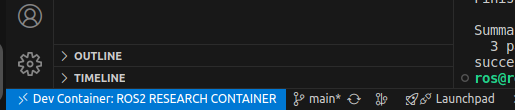
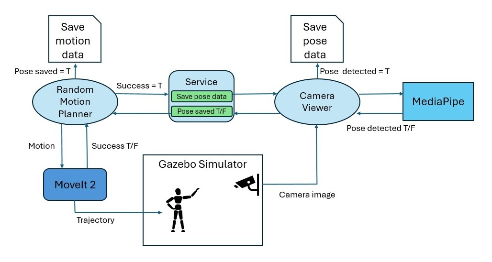

# Humanoid Motion Capture (2.0.0)


This project develops a system for translating human pose detection to humanoid robot motion in simulation environments. Using Google MediaPipe for pose landmark detection from camera input, the system maps detected human poses to corresponding joint movements executed by a humanoid robot in Gazebo simulator. The implementation leverages ROS2 Humble and MoveIt2 for motion planning and control, with a data generation pipeline that creates training pairs of pose landmarks and robot joint configurations. This approach provides a foundation for safety monitoring applications in industrial simulation (SIMLAN), where human pose analysis can be integrated for workplace incident detection.

This work builds upon the master's thesis by Tove Casparsson and Siyu Yi, supervisor by Hamid Ebadi completed in June 2025. The original thesis code is available in the  [master-thesis-2025](https://github.com/infotiv-research/humanoid-mocap/tree/master-thesis-2025) branch.


Click the YouTube link below to view the humanoid motion capture demo video:

[](https://www.youtube.com/watch?v=-jM3-71x7ZQ)


## Terminology:


- Forward Kinematics (FK): The process of calculating the position and orientation of a robot's links given the values of its joint parameters (e.g., angles or displacements). In other words, FK answers the question: "Where is the robot's hand if I know all the joint values? (usually have one answer)"
- Inverse Kinematics (IK): The process of determining the joint parameters (e.g., angles or displacements) required to achieve a desired position and orientation of the robot's links. In other words, IK answers the question: "What joint values will place the robot’s hand here? (usually have many answers)"
- Pose : 3D pose landmarks (MediaPipe) extracted by Mediapipe from an 2D image of human posture
- Motion : A kinematic instruction (joint parameters) sent to the robot (via MoveIt) for execution. While "kinematic instruction" would be a more accurate term, we continue to use "motion" for historical reasons (used in the word motion-capture), even though , "motion" often refers to the difference/movement between two postures (e.g., posture2 - posture1).
- Motion Capture: Here it means using 2D images to find the motion(kinematic instruction/joint parameters) to instruct a humanoid robot to mimic the human posture.

## Dependencies

You can use [these commands (tested on Ubuntu 24.04)](DEPENDENCIES.md) to install  docker and ensure that your linux user account has `docker` access.

*Attention*: Make sure to restart the computer (for the changes in group membership to take effect.) before proceeding to the next step.


## Installation

To improve collaboration in development environment we use vscode and docker as explained in [this instruction](https://www.allisonthackston.com/articles/docker-development.html) using these [docker files](https://github.com/athackst/dockerfiles). For production environment follow installation procedure used in [.devcontainer/Dockerfile](.devcontainer/Dockerfile) to install dependencies.

Install Visual Studio Code (VS Code) and open the project folder. VS Code will prompt you to install the required extension dependencies.
Make sure the `Dev containers` extension is installed. Reopen the project in VS Code, and you will be prompted to rebuild the container. Accept the prompt, this process may take a few minutes.
Once VS Code is connected to Docker (as shown in the image below), open the terminal and run the following commands:



(if you don't see this try to build manually in vscode by pressing `Ctrl + Shift + P` and select `Dev containers: Rebuild and Reopen in container`.
)

## Quick start
To build the project inside vscode dev-container:

```
./control.sh build
```

All the following commands need to be executed from vscode terminal within Dev container.

## Dataset creation
The below image describes how the dataset generation system works.




The command below  creates paired pose data and motion data.

```
./control.sh dataset DATASET/TRAIN # or DATASET/EVAL

```

The resulting files are stored as parallel `.json` files in the folders `DATASET/TRAIN/pose_data`, `DATASET/TRAIN/motion_data`, `DATASET/TRAIN/pose_images`. 
To avoid creation of `pose_images` that are only used as the ground truth and debugging (specially if you are building your training data), comment out then call to `self.save_pose_image()` in `camera_viewer.py`.

Finally to merge them all in tabular `.csv` file run the following command.
```
./control.sh convert2csv
```
Results in merging:
- `DATASET/TRAIN` to `DATASET/train.csv`
- `DATASET/EVAL` to `DATASET/eval.csv`

You can replay_motion each motion data separately: `./control.sh replay_motion DATASET/EVAL/motion_data/AAAAAAA_motion.json`

## Train

You can read about the training step in this [README.md document](pose_to_motion/README.md)

> Keep in mind that we use a separate virtual environment to install machine learning related pip packages called `mlenv`  with a separate [`requirements.txt`](pose_to_motion/MLrequirements.txt). Build the environment first using `./control.sh mlenv`


This step reads data from `DATASET/train.csv` and trains our model:

```
./control.sh train
```
The resulting model is saved in `models/`.

## Inference

The following command uses MediaPipe to create pose data from an image or a video in `input/` to populate `output/` with mediapipe lankmark pose and images. 

```
./control.sh image_pipeline
./control.sh video_pipeline
```
To use the model on each generated pose run the following command

```
./control.sh predict output/
```

Alternatively, you can also run similar command to do prediction on the validation data. Using evaluation dataset opens up a image viewer with the ground truth mediapipe detection as well to quickly check the performance of our ml model:
```
./control.sh predict DATASET/EVAL
```
## Project Structure:
- [`input/`](input) : This folder has the pose data to be predicted
- [`output/`](output) : This folder saves the predicted motion data and intermediate results
- [`models/`](models) : This folder save the `pose_motion_model.pth`, loss plots and training params
- [`DATASET/TRAIN`](DATASET/TRAIN): Currently empty, but motion, pose and image files generated by `./control.sh dataset DATASET/TRAIN` are stored here.
  - `motion_data` : Corresponsing random motion (request)
  - `pose_data` : Mediapipe pose (result)
  - `pose_images`: Mediapipe annotated images and original images
- [`DATASET/EVAL`](DATASET/EVAL): Few sample motion, pose and image files.
- [`pose_to_motion/`](pose_to_motion): Contains the ML training pipeline for pose-to-motion prediction
  - [`mp_detection.py`](mp_detection.py): Handles pose detection from actual images or videos using MediaPipe
- [`src/`](src/): ROS2 packages
  - [`camera_system/`](src/camera_system/): camera model files and scripts to launch the camera and start pose capture
  - [`humanoid_robot/`](src/humanoid_robot/): model files, URDFs, world and launch files for the humanoid
  - [`humanoid_support_moveit_config/`](src/humanoid_support_moveit_config/): MoveIt2 config files for the humanoid and supporter
  - [`random_motion_planner/`](src/random_motion_planner/): scripts to launch and execute random motions with the humanoid


This project is currently maintained by Hamid Ebadi.

## Research Funding

This work was carried out within these research projects:

- The EUREKA [ITEA4](https://www.vinnova.se/p/artwork---the-smart-and-connected-worker/) ArtWork - The smart and connected worker financed by Vinnova under the grant number 2023-00970.