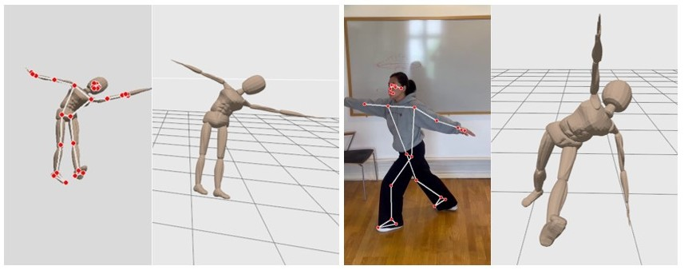

# Humanoid Motion Capture

This project develops a system for translating human pose detection to humanoid robot motion in simulation environments. Using Google MediaPipe for pose landmark detection from camera input, the system maps detected human poses to corresponding joint movements executed by a humanoid robot in Gazebo simulator. The implementation leverages ROS2 Humble and MoveIt2 for motion planning and control, with a data generation pipeline that creates training pairs of pose landmarks and robot joint configurations. This approach provides a foundation for safety monitoring applications in industrial simulation (SIMLAN), where human pose analysis can be integrated for workplace incident detection. (Tove Casparsson and Siyu Yi, Supervisor: Hamid Ebadi, June 2025)



## Installation

Outside vscode in a terminal: `xhost +local:root`

Install Docker and add the `docker` user. Then install Visual Studio Code (VS Code) and open the project folder. VS Code will prompt you to install the required extension dependencies.
Make sure the `Dev containers` extension is installed. Reopen the project in VS Code, and you will be prompted to rebuild the container. Accept the prompt, this process may take a few minutes.
Once VS Code is connected to Docker (as shown in the image below), open the terminal and run the following commands:


(if you don't see this try to build manually in vscode by pressing `Ctrl + Shift + P` and select `Dev containers: Rebuild and Reopen in container`.
)

To build the project inside vscode dev-container:

```
./control.sh build
```

## Dataset creation

This step creates paired pose data and motion data.

```
./control.sh dataset
```

The resulting files are stored in the folders `DATASET/pose_data`, `DATASET/motion_data`, `DATASET/pose_images`.

The below image describes how the dataset generation system works.


## Train

This step reads data from `DATASET/pose_data` and `DATASET/motion_data` and trains the model:

```
./control.sh train
```
The resulting model is saved in `models/models/pose_motion_model.pth`.

Take a look at [pose_to_motion/](pose_to_motion/) to see different models and how to switch between them.

## Inference

The following command uses MediaPipe to create pose data from an image (here `input/999999999.png`), reads the resulting pose from `input/999999999.png_data.json`, uses the `pose_motion_model.pth` model to predict the motion, saves it in `output/999999999_prediction.json`, and replays the motion.

```
./control.sh image_pipeline
```

The next command reads `input/20250611video.mp4`, splits it into frames, reads the resulting pose from each frame, uses the same model as above to predict the motions, the replays each motion in sequence. The results are stored in the `output` directory.

```
./control.sh video_pipeline
```


## Project Structure: 
- [`input/`](input) : This folder has the pose data to be predicted
- [`output/`](output) : This folder saves the predicted motion data
- [`models/`](models) : This folder save the `pose_motion_model.pth`, loss plots and training params
- [`DATASET/`](DATASET): Contains motion, pose and image files generated by `./control.sh dataset`
- [`pose_to_motion/`](pose_to_motion): Contains the ML training pipeline for pose-to-motion prediction
- [`pose_detection/`](pose_detection): Handles pose detection from images or videos using MediaPipe
- [`src/`](src/): ROS2 packages
  - [`camera_system/`](src/camera_system/): camera model files and scripts to launch the camera and start pose capture
  - [`humanoid_robot/`](src/humanoid_robot/): model files, URDFs, world and launch files for the humanoid
  - [`humanoid_support_moveit_config/`](src/humanoid_support_moveit_config/): MoveIt2 config files for the humanoid and supporter
  - [`random_motion_planner/`](src/random_motion_planner/): scripts to launch and execute random motions with the humanoid


## Research Funding

This work was carried out within these research projects:

- The EUREKA [ITEA4](https://www.vinnova.se/p/artwork---the-smart-and-connected-worker/) ArtWork - The smart and connected worker financed by Vinnova under the grant number 2023-00970.