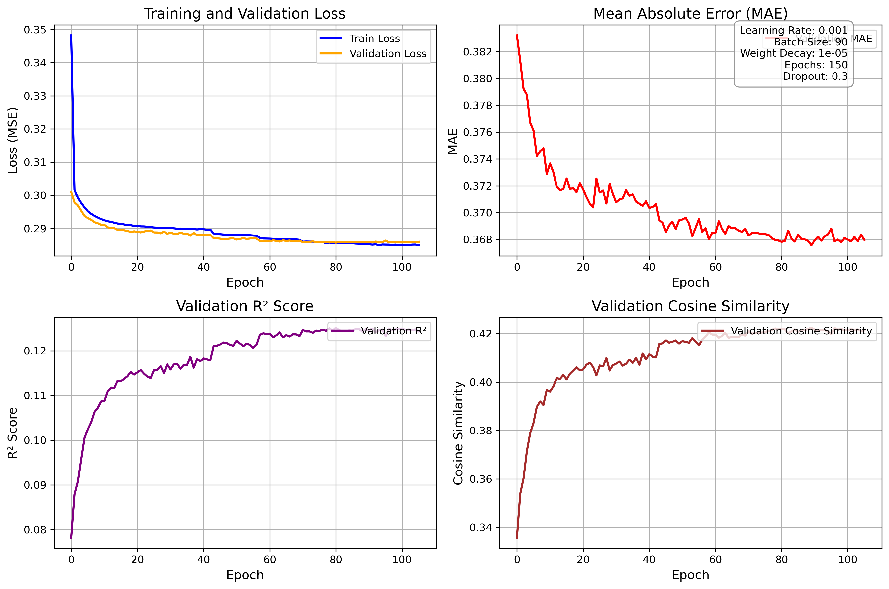

# Translation of a detected pose to humanoid motion command​
This project employs a deep neural network to learn the mapping between human pose and humanoid robot motion. The model takes 33 MediaPipe pose landmarks as input and predicts corresponding robot joint positions.

## Neural network design
- Input Layer: 33 MediaPipe pose landmarks (x, y, z coordinates)
- Hidden Layers: Multi-layer perceptron with pose normalization preprocessing
- Output Layer: Robot joint position sequences for humanoid motion control
- Training: Supervised learning on pose-motion paired datasets

## Training result
