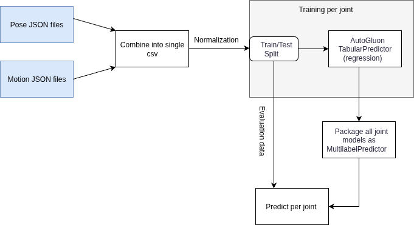
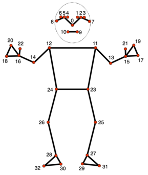
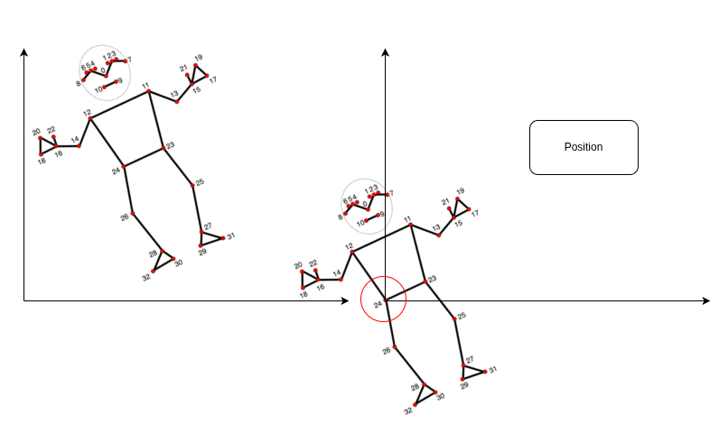

# Overview 

The diagram below shows the overall workflow of this project. Pose and motion data are first collected from JSON files and combined into a single CSV file. Each robot joint is trained separately using AutoGluon TabularPredictor (regression). All joint models are then packaged together as a MultilabelPredictor, which is used to predict robot motion from new pose inputs.

# Feature Engineering (TODO)

Instead of the previous normalization, only normalize and find the angle between each point and a reference vector such as pelvis (nodes 23 and 24). This way no position, scale and rotation normalisation is needed.

- Distances between points
- Relative angles

# Dataset

Each row in the CSV file represents one pose sample and its corresponding robot motion.
- The first columns are the 3D coordinates (x, y, z) for each of the 33 MediaPipe pose landmarks, named like `0_x, 0_y, 0_z, 1_x, 1_y, 1_z, ...`.
- The remaining columns are the robot joint positions (motion targets) for that sample, with names like `jRightShoulder_rotx`, `jLeftElbow_roty`, etc.

# Preprocessing

https://ai.google.dev/edge/mediapipe/solutions/vision/pose_landmarker

Three steps of normalization of mediapipe landmarks:
- Position normalization
- Scale normalization
- Rotation normalization

## Translation of a detected pose to humanoid motion command​

This project employs a deep neural network to learn the mapping between human pose and humanoid robot motion. The model takes 33 MediaPipe pose landmarks as input and predicts corresponding robot joint positions.

## Neural network design

- Input Layer: 33 MediaPipe pose landmarks (x, y, z coordinates)
- Hidden Layers: Multi-layer perceptron with pose normalization preprocessing
- Output Layer: Robot joint position sequences for humanoid motion control
- Training: Supervised learning on pose-motion paired datasets

